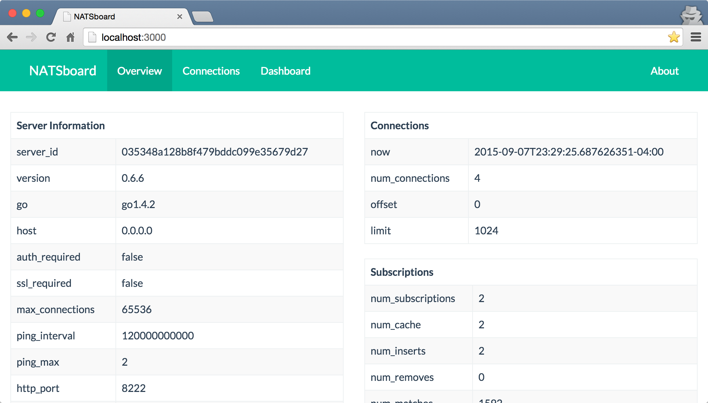
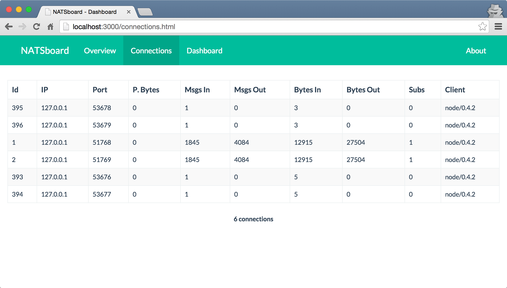
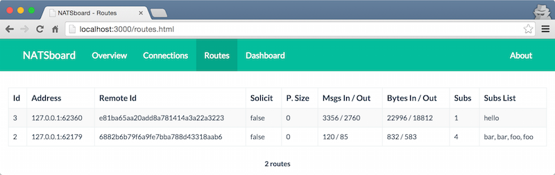
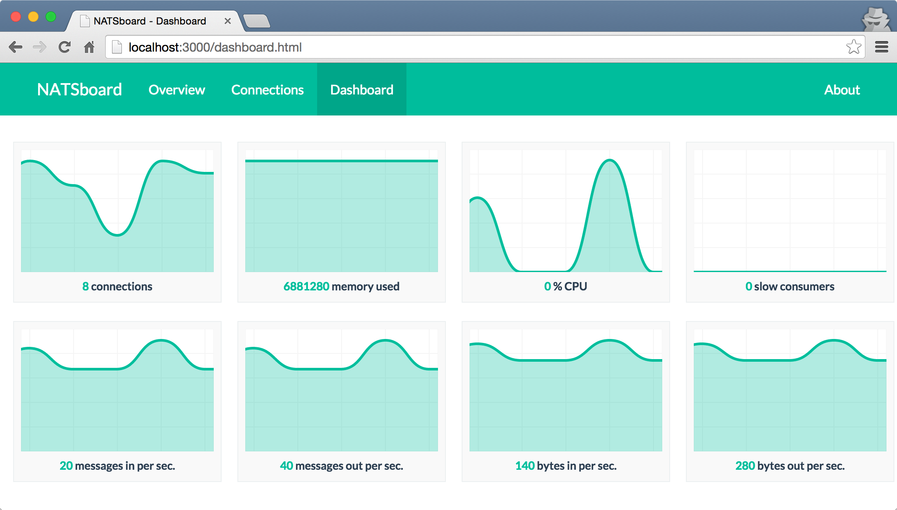

## NATSboard

[![NPM][npm-image]][npm-url] [![Build Status][travis-image]][travis-url]

Dashboard for monitoring NATS. It provides real-time information from NATS server.









### Installation

```
npm install natsboard -g
```

### Usage

[gnatsd server](http://nats.io/download/) **should** be running with `-m` parameter.

```
gnatsd -m 8222
natsboard
```
```
gnatsd -m 12345
natsboard --nats-mon-url http://localhost:12345
```
#### Docker Usage
docker run -d -p 3000:3000 -p 3001:3001 --env NATS_MONITOR_URL=http://IPADDRESS:8222 urashidmalik/natsboard
- Replace IPADDRESS with ip or host of nats machine/vm/host running docker container
### License

Licensed under The MIT License (MIT)  
For the full copyright and license information, please view the LICENSE.txt file.

[npm-url]: http://npmjs.org/package/natsboard
[npm-image]: https://badge.fury.io/js/natsboard.svg

[travis-url]: https://travis-ci.org/fatihcode/natsboard
[travis-image]: https://travis-ci.org/fatihcode/natsboard.svg?branch=master
